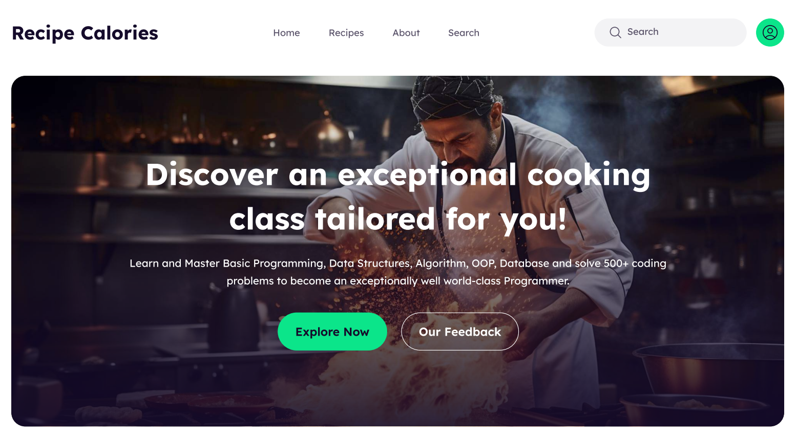

<h1 align="center">🍳 Recipe Calories – Smart Recipe Nutrition Tracker</h1>

  Organize your cooking with an interactive recipe tracker — add recipes, manage your cooking process, and stay on top of your meals effortlessly.

  
  
  
  

---

## 🧾 Overview

**Recipe Calories** is a sleek, front-end focused web app designed to help users manage their cooking workflow easily. Add recipes to your **Want to Cook** list, move them to **Currently Cooking**, and keep your meal prep organized with simple, intuitive controls and a clean UI.

---

## ✨ Key Features

- 📋 **Dynamic Recipe Tracking**  
  - Add recipes to *Want to Cook* list  
  - Move recipes to *Currently Cooking* status  
  - Button states update dynamically to avoid duplicate actions

- 📱 **Responsive & Interactive UI**  
  - Mobile, tablet, and desktop friendly design  
  - Built with **Tailwind CSS** and **DaisyUI** for smooth, modern experience

- ⚡ **Fast State Management**  
  - Uses React’s `useState` hook for seamless user interaction  

- 🔗 **Deployment Ready**  
  - Hosted on Vercel for fast and reliable access  

---

## 📸 Preview

---

## 🔧 Tech Stack

| Technology       | Description                        |
|------------------|----------------------------------|
| **React**        | UI framework                     |
| **JavaScript**   | Logic and interactivity           |
| **Tailwind CSS** | Responsive, utility-first styling |
| **DaisyUI**      | Component library for Tailwind    |
| **useState Hook**| React state management            |

---

## 🚦 How It Works

1. Browse recipes on the homepage.  
2. Click **Want to Cook** to add a recipe to your cooking list.  
3. When ready, move the recipe to **Currently Cooking** — the button disables to prevent repeat additions.  
4. Easily track your cooking workflow with a clean and simple UI.

---

## 🔮 Possible Future Enhancements

- Integration of nutrition facts and calorie breakdown  
- User authentication for personalized recipe tracking  
- Recipe search and filtering options  
- Offline access with service workers  

